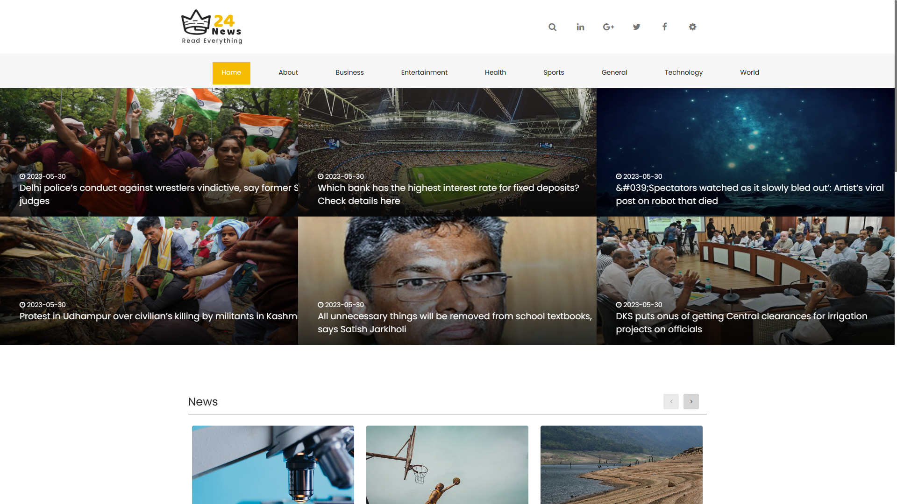
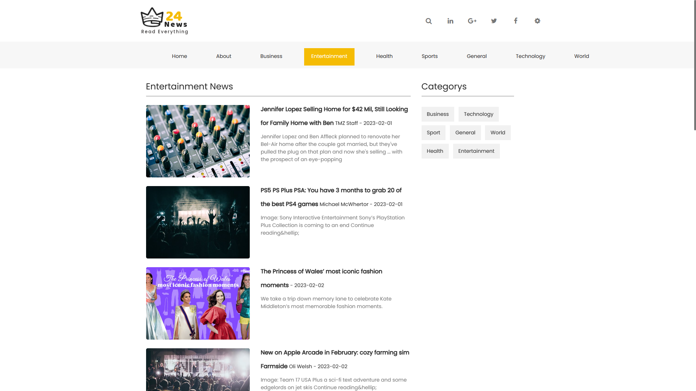
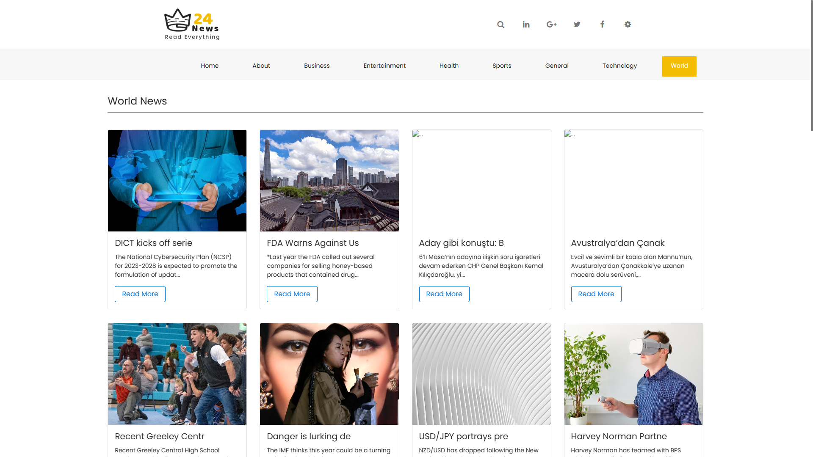
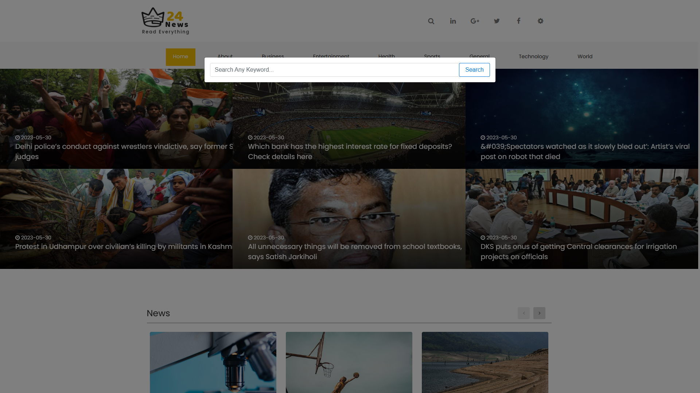
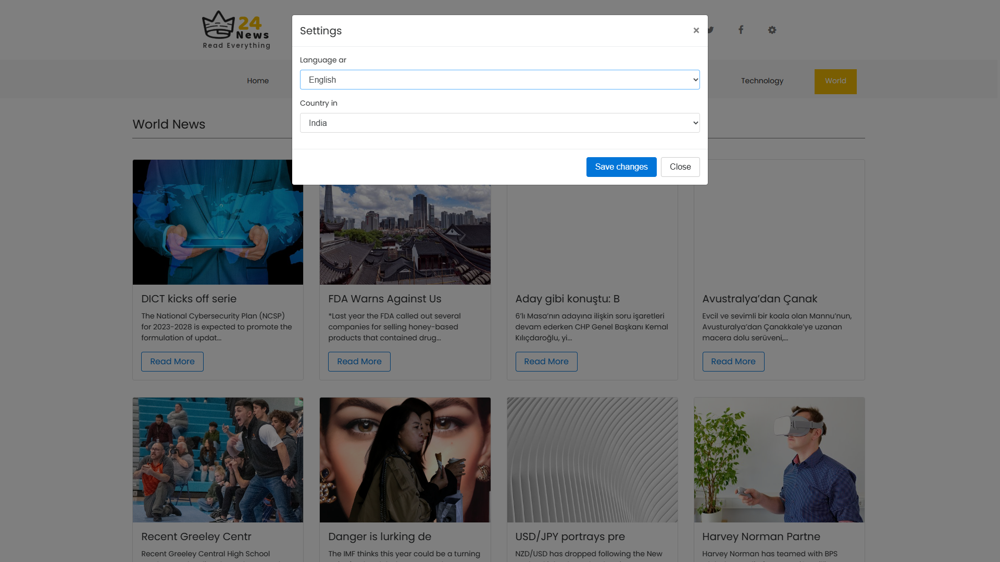

# News Application API

Create News application in python django framework with API.

Welcome to the News Application project! This application is designed to provide users with a convenient platform for browsing and consuming news articles from various sources. It offers a user-friendly interface, personalized news feeds, real-time updates, and a range of features to enhance the news reading experience.

## Features

1) News Feed: Users can browse a personalized news feed, customized based on their interests and reading history.

2) Search : Users can search for specific news articles or filter content by categories, keywords, or sources.

3) Article Reading: Users can view complete articles with rich content, including images, videos, and related links.

4) Push Notifications: Users can opt-in to receive push notifications for breaking news stories or personalized updates.

5) Personalization: The application learns user preferences and provides tailored news recommendations based on reading history and interests.

6) Analytics and Reporting: The system collects data on user behavior, popular articles, and trending topics to generate insights.


## Technologies Used

**Frontend:** HTML, CSS, Javascript, JQuery

**Backend:** Python, Djnago

**Third Party:** API

## Installation

Clone News Application Repository 

```bash
    git clone https://github.com/Dhadukparth/News-Application-API.git
```

Install Python

```bash
    https://www.python.org/ftp/python/3.11.3/python-3.11.3-amd64.exe
```

Install Virtual Environment

```bash
    pip install virtualenv
```

Create Virtual Environment
```bash
    python -m venv env
```

Activate the environment
```bash
    C:\User\NewsApplication> cd env\Scripts\activate.bat
```

Install Project Packages
```bash
    pip install -r requirements.txt
```
    
Run the all migrations
```bash
    python manage.py makemigrations
```

Run the migrate
```bash
    python manage.py migrate
```

Run the application 
```bash
    python manage.py runserver
```

## Screenshots











## Contributing

Contributions to the News Application project are welcome! If you have any suggestions, bug reports, or feature requests, please submit an issue or a pull request. Let's work together to make the application even better.

## License

The News Application project is open-source and released under the MIT License. Feel free to use, modify, and distribute the code as per the terms of the license.

Enjoy using the News Application and stay informed with the latest news!
## Thank You 😀😀😀